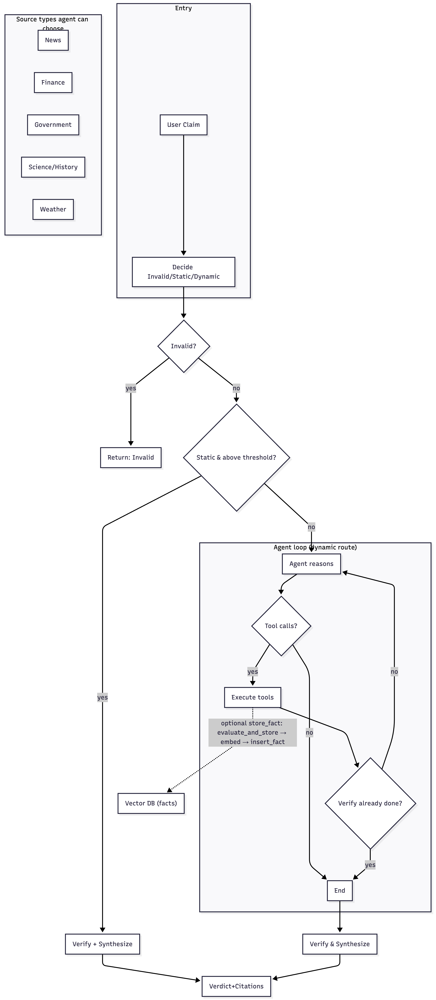

# Real-Time News Claim Verification Assistant

An agentic RAG (Retrieval-Augmented Generation) system that verifies user claims by gathering evidence from a static knowledge base and live web sources, then producing a transparent verdict with citations.

## Architecture


- **Router** — LLM classifies claim as static, dynamic, or invalid.
- **Static KB** — pgvector (HNSW + reranker); documents and stored facts.
- **Dynamic Sources** — Web scrapers and APIs (news, finance, govt, weather, etc.).
- **Agent** — LangGraph agent gathers evidence via retrieval, then calls verify.
- **Verify & Synthesize** — LLM verdict on claim vs evidence; optional fact storage back to pgvector.

---

### Full working flow (agentic loop)

Entry runs **router** and **static KB search** in parallel (eager). Then:

1. **Invalid** → return immediately with "Invalid" verdict.
2. **Static + above similarity threshold** → verify against static results and synthesize; no agent.
3. **Otherwise** → agent runs with precomputed route and static result. Agent loop:


- **Agent** receives the claim plus precomputed route (static/dynamic + optional domain) and static KB result (with `above_threshold`).
- Each turn the agent either **calls tools** or **stops**. If it calls tools, **Execute tools** runs (one or more of: static KB, news, finance, government, science/historical, weather).
- Evidence from retrieval tools is accumulated; when the agent calls **verify**, that evidence is passed in.
- After tools: if **verify** was already called → exit loop; else → back to **Agent** for the next turn (e.g. more retrieval or final verify).
- If the agent hits **max steps** without calling verify, the pipeline runs verification on any collected evidence (or a fallback dynamic search) and then synthesizes.

---

### Dry run: static flow

**Scenario:** Claim is about the EU AI Act (covered by the static KB).

| Step | What happens |
|------|-------------------------------|
| 1 | Claim enters; **route** and **static KB** run in parallel. |
| 2 | Router returns `route: "static"`. Static KB returns chunks with **similarity above threshold**. |
| 3 | Short-circuit: **invalid?** No. **Static & above threshold?** Yes. |
| 4 | **Verify** runs on static KB evidence (no agent). **Synthesize** formats verdict + citations. |
| 5 | **Return** verdict + reasoning + citations. Optional: stable fact stored back to pgvector. |

No agent loop; path is: **Claim → Eager → Static hit → Verify → Out.**

---

### Dry run: dynamic flow

**Scenario:** Claim is “What is the current inflation rate in India?” (needs live data).

| Step | What happens |
|------|-------------------------------|
| 1 | Claim enters; **route** and **static KB** run in parallel. |
| 2 | Router returns `route: "dynamic"`, `domain: "finance"`. Static KB returns low similarity (**below threshold**). |
| 3 | No short-circuit. **Agent** starts with precomputed route + static result. |
| 4 | **Agent turn 1:** Reasons that claim needs current finance data. **Decision:** call tool → e.g. **Finance** source. |
| 5 | **Tools:** Finance source runs; evidence (e.g. Livemint) is returned and accumulated. |
| 6 | **After tools:** Verify not called yet → back to **Agent**. |
| 7 | **Agent turn 2:** Has evidence. **Decision:** call **verify** (with accumulated evidence). |
| 8 | **Tools:** Verify runs; returns verdict + reasoning + citations. |
| 9 | **After tools:** Verify already in messages → **exit loop**. **Synthesize** → return verdict + citations. |

If the agent had wanted more evidence, it could have chosen **News** or **Government** in another turn before calling verify; the loop continues until the agent calls verify or hits max steps.

---

### Diagram notes: parallelism, retrieval pipeline, and fact storage

**1. What runs in parallel? Are the static and dynamic routes parallel?**

Only the **Eager** step is parallel: **Route** (LLM classifies the claim) and **Static Search** (embed query → search pgvector → rerank) run **concurrently** at entry. Nothing else.

- The **static path** (Verify + Synthesize when static is above threshold) and the **dynamic path** (agent loop) do **not** run in parallel. The diagram is sequential after Eager: we first check Invalid, then Static & above threshold. Only if static is **below** threshold do we enter the agent loop. So the dynamic route is a **conditional fallback**, not a parallel branch.

**2. Where do reranking, chunking, and embedding happen?**

| Step | Where | When |
|------|--------|------|
| **Chunking** | `src/ingestion/chunker.py` | **Offline**, during KB ingestion (e.g. `scripts/ingest_data.py`): raw docs → 512-token chunks with 50-token overlap. Not in the query-time flow. |
| **Embedding (docs)** | `src/ingestion/vectorizer.py` + `src/core/embeddings.py` | **Offline**, during ingestion: each chunk is embedded and stored in the **documents** table. |
| **Embedding (query)** | `src/core/embeddings.py` inside `src/retrieval/static.py` | **Query time**: the user claim is embedded once for the static KB search. |
| **Reranking** | `src/core/reranker.py` inside `src/retrieval/static.py` | **Query time**, inside **Static Search**: after retrieving from pgvector (documents + facts), results are reranked with a cross-encoder, then we check the similarity threshold. |

So in the diagram, **chunking and doc embedding** are part of building the Vector DB (ingestion, not shown). **Query embedding** and **reranking** both happen inside the **Eager: Static Search** box (and again if the agent queries the static KB later).

**3. Post–dynamic search: how do we put facts into the Vector DB?**

Yes. After the agent gathers evidence (e.g. from News, Finance, Government) and calls **Verify & Synthesize**, it can optionally call **store_fact**. That is the path that writes back to the Vector DB:

1. **Agent** calls the `store_fact` tool (prompted to do so for stable/historical facts; weather is never stored).
2. **store_fact** (in `src/agent/tools.py`) runs `evaluate_and_store(claim, evidence, domain)` in a **background thread** so the response is not delayed.
3. **evaluate_and_store** (`src/retrieval/store.py`):  
   - LLM (STABILITY_PROMPT) decides whether the evidence is **stable** and returns a **normalized fact** string.  
   - Deduplication by **content hash**: if that fact already exists in the KB, we skip insert.  
   - Otherwise: **embed** the normalized fact (`get_embedding`), then **insert_fact** into pgvector (facts table).

So the flow is: **Verify & Synthesize** → (optional) **Store fact** → **evaluate_and_store** → embed → **insert_fact** → Vector DB. The diagram does not show this explicitly; the “Store fact” step is inside the agent loop as an optional tool call after verify.

## Features

- **Agentic RAG**: Multi-step reasoning with self-correction, re-querying, and multi-source consensus
- **Query Router**: LLM-based classification (static/dynamic/invalid) with domain detection
- **Static KB**: pgvector with HNSW indexing + cross-encoder reranking
- **Dynamic Sources**: BBC News, ANI, Livemint, RBI, IBEF, Open-Meteo weather
- **Fact Storage**: LLM-normalized facts stored with deduplication
- **Transparent Reasoning**: Full agent reasoning trace in responses

## Quick Start

**For a step-by-step testing checklist, see [TESTING.md](TESTING.md).**

### Prerequisites

- Python 3.11+
- Docker (for Postgres + pgvector)
- OpenAI API key (real key required; web search uses the Responses API)

### Setup

```bash
# 1. Clone and enter the project
cd challenge-1

# 2. Create a virtual environment
python -m venv .venv
source .venv/bin/activate

# 3. Install dependencies
pip install -r requirements.txt

# 4. Copy and edit environment variables
cp .env.example .env
# Edit .env with your OpenAI API key

# 5. Start Postgres with pgvector
docker-compose up -d

# 6. Initialize the database
python scripts/setup_db.py

# 7. Ingest EU AI Act data into the knowledge base
python scripts/ingest_data.py
```

### Usage

```bash
# CLI
python cli.py "The EU AI Act bans social scoring systems."

# With verbose logging
python cli.py --verbose "What is the current inflation rate in India?"

# With agent reasoning trace
python cli.py --trace "Is it raining in Mumbai?"

# Programmatic
python main.py "Who won the 2024 US election?"
```

### Programmatic API

```python
from main import verify_claim

result = verify_claim("The EU AI Act classifies AI into risk categories.")
print(result["verdict"])          # "Supported"
print(result["formatted_response"])  # Full formatted response with citations
print(result["reasoning_trace"])  # Agent's step-by-step reasoning
```

## Project Structure

```
01AILeague/
├── config/              # Settings and logging configuration
├── src/
│   ├── agent/          # LangGraph agent, tools, prompts
│   ├── core/           # Router, embeddings, reranker, verification
│   ├── retrieval/      # Static (pgvector) and dynamic retrieval
│   ├── scrapers/       # Domain-specific scrapers (news, finance, govt, weather)
│   ├── ingestion/      # Docling parser, chunker, vectorizer
│   ├── database/       # SQLAlchemy models, connection, operations
│   └── utils/          # Text processing, hashing, validators
├── scripts/            # DB setup and data ingestion scripts
├── tests/              # Pytest test suite
├── cli.py              # CLI entry point
├── main.py             # Programmatic entry point
└── docker-compose.yml  # Postgres + pgvector
```

## Technical Details

- **Embedding Model**: OpenAI `text-embedding-3-small` (1536 dims)
- **Vector DB**: PostgreSQL + pgvector with HNSW indexes
- **Chunking**: 512 tokens with 50-token overlap
- **Reranking**: `cross-encoder/ms-marco-MiniLM-L-6-v2`
- **LLM**: OpenAI GPT-4o-mini (routing + synthesis)
- **Agent Framework**: LangGraph (multi-step reasoning with tool use)
- **Initial KB**: EU AI Act website (parsed via Docling)

## Running Tests

```bash
pytest tests/ -v
```

## Data Sources

| Domain     | Sources                    | Type        |
|------------|----------------------------|-------------|
| Static KB  | pgvector (EU AI Act, etc.) | Vector DB   |
| News       | BBC News, ANI              | Web scrape  |
| Finance    | Livemint                   | Web scrape  |
| Government | RBI, IBEF                  | Web scrape  |
| Weather    | Open-Meteo                 | Free API    |
